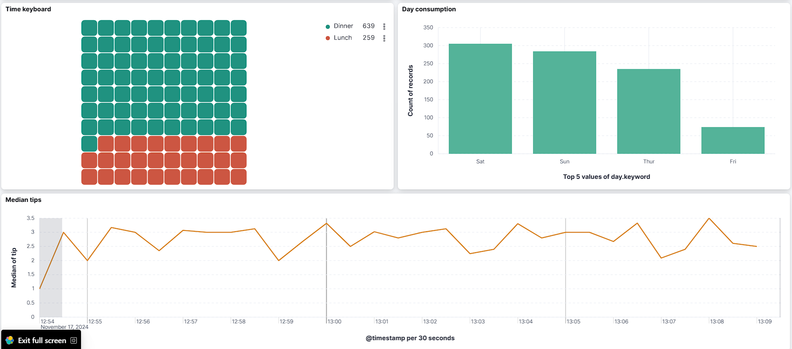
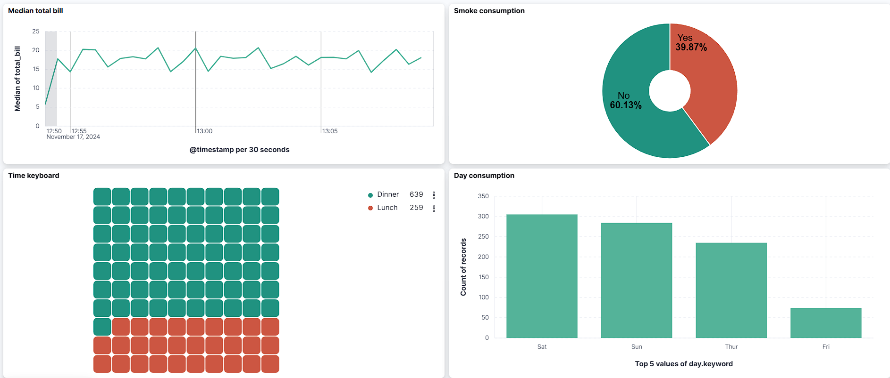

# MQTT-Kafka-ELK Bridge


Bu proje, **MQTT** protokolü ile veri akışını başlatıp, **Kafka** ile aktarılan verilerin **ELK (Elasticsearch, Logstash, Kibana)** yığını kullanılarak analiz edilmesini ve görselleştirilmesini sağlayan bir altyapı sunar. Proje, Docker konteynerleri ile izole bir şekilde çalışacak şekilde tasarlanmıştır ve bütün servisler otomatik olarak başlatılmaktadır.




---

## Özellikler

- **MQTT Broker** ile gerçek zamanlı veri yayını ve aboneliği
- **Apache Kafka** kullanarak yüksek performanslı veri iletimi
- **Logstash** ile Kafka'dan Elasticsearch'e veri aktarımı
- **Elasticsearch** ile verilerin indekslenmesi ve sorgulanması
- **Kibana** ile görselleştirme ve analiz
- Docker Compose kullanılarak tüm servislerin kolay kurulum ve başlatılması

---

## Kullanılan Teknolojiler

- **MQTT Broker** - Verilerin yayınlanması ve alınması için
- **Apache Kafka** - Veri kuyruğu ve aktarımı için
- **Logstash** - Verilerin işlenmesi ve Elasticsearch'e aktarılması için
- **Elasticsearch** - Veri depolama ve sorgulama için
- **Kibana** - Görselleştirme ve analiz için
- **Docker** - Servislerin izole bir ortamda çalıştırılması için
- **Docker Compose** - Tüm servisleri yönetmek ve başlatmak için

---

## Kurulum

### Gereksinimler

- [Docker](https://www.docker.com/get-started) ve [Docker Compose](https://docs.docker.com/compose/install/) yüklenmiş olmalıdır.

### Adımlar

1. Bu projeyi klonlayın:
   ```bash
   git clone https://github.com/TarikYil/MQTT-Kafka-ELK-Bridge.git
   cd MQTT-Kafka-ELK-Bridge
2. Docker Compose ile konteynerleri başlatın:
    ```bash
    docker-compose up --build -d
3. Kibana arayüzüne erişim için:
    ```bash
    http://localhost:5601

### Kullanım
- Kod içerisinde Seaborn kütüphanesinden tips veri seti, MQTT ile gönderiliyor olacaktır.
Konteynerler ayağa kalktığında, consumer konteyneri Kafka'yı otomatik olarak dinleyecektir. Herhangi bir kod çalıştırmanıza gerek yoktur.
- İsterseniz kendi veri setinizi değiştirebilir veya farklı bir MQTT broker kullanacaksanız ilgili bağlantıları buna göre yapılandırabilirsiniz.
- Kibana arayüzüne erişin ve bir Index Pattern oluşturarak verilerinizi görselleştirin.

## Proje Yapısı
    
    KAFKA-ELK/
    ├── logstash/
    │   ├── pipeline/
    │   │   └── logstash.conf        # Logstash pipeline konfigürasyonu
    │   └── Dockerfile               # Logstash için Docker dosyası
    ├── mqtt/
    │   ├── broker/
    │   │   └── mosquitto.conf       # MQTT Broker konfigürasyonu
    │   ├── client/
    │   │   ├── publisher.py         # MQTT Publisher (Veri gönderen istemci)
    │   │   └── subscriber.py        # MQTT Subscriber (Veri alan istemci)
    │   ├── Dockerfile               # MQTT için Docker dosyası
    │   └── requirements.txt         # MQTT bağımlılıkları
    ├── venv/                        # Sanal Python ortamı
    ├── .env                         # Çevresel değişkenler
    ├── .gitignore                   # Git için ignore dosyası
    ├── docker-compose.yml           # Tüm servisleri yöneten Docker Compose dosyası
    └── README.md                    # Proje dokümanı

.env dosyasını oluşturun ve yapılandırın.


